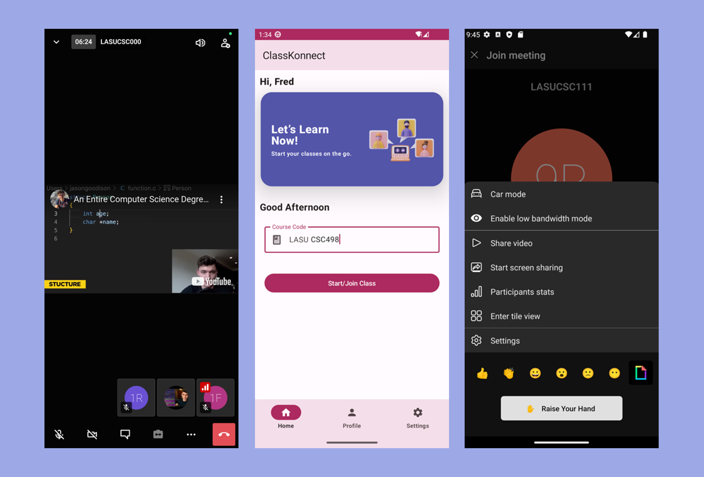

<a href="https://appetize.io/app/xrbg72g6pdiaaemtcibupyyx3i?device=pixel7&osVersion=13.0&scale=75" target="_blank" rel="nofollow noopener noreferrer" 
  aria-label="Live Demo"> <u>Live Demo 🚀</u> </a>

# EClass renamed to ClassKonnect

---

## A Short Story

I built it because of the issues we faced using Zoom for online classes during the Covid-19 pandemic. Because we mostly used the free version, we were disconnected every 40 minutes and had to log back in. 
I initially built the app with android Fragments as the views, but I was excited by the buzz surrounding the stable release of Jetpack Compose especially at Devfest 2022. I decided to rewrite the app with compose and ended up learning a lot from that. It even drove me to dive into the world of Wear OS development as wear also received Compose support. Two months later, inspite of my final year exams, I released <a href="https://github.com/Vader-Femi/Devfesttttt" target="_blank" rel="nofollow noopener noreferrer" aria-label="Devfesttttt Link"><u>my first Wear OS application (Devfesttttt)</u></a> but that's a story for another day.

---

## Kinda my final year project

An Android video call app made using Jitsi Meet SDK to improve E-Learning in educational institutions. It can connects up to 75 participants/students learning synchronously from a live video conferencing lecture. It was built using open-source Jitsi Meet SDK, Firebase SDK, Dagger-Hilt for dependency Injection, and yes Jetpack Compose. It is a free alternative to schools with a maximum capacity of 75 participants per class.

Did I mention it was written in Compose? This is a my first Compose project so you can understand the excitement.

---

## License

[Apache License](LICENSE)

